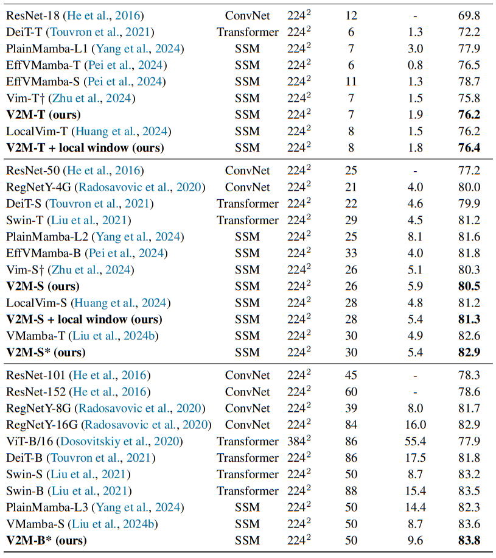

# V2M: Visual 2-Dimensional Mamba for Image Representation Learning

This repository is the official implementation of **V2M: Visual 2-Dimensional Mamba for Image Representation Learning**

## [Paper](http://arxiv.org/abs/2410.10382)

> V2M: Visual 2-Dimensional Mamba for Image Representation Learning

> [Chengkun Wang](https://scholar.google.com/citations?user=69-8jtcAAAAJ&hl=zh-CN&oi=sra), [Wenzhao Zheng](https://wzzheng.net/), [Yuanhui Huang](https://scholar.google.com/citations?hl=zh-CN&user=LKVgsk4AAAAJ), [Jie Zhou](https://scholar.google.com/citations?user=6a79aPwAAAAJ&hl=en&authuser=1), [Jiwen Lu](http://ivg.au.tsinghua.edu.cn/Jiwen_Lu/)

## Motivation of V2M


Previous vision Mambas processed image tokens with 1D SSM, whereas we extend SSM to a 2D form for more suitable image representation
learning by introducing the prior of enhancing the relevance of adjacent regions for modeling.

## Overall framework of V2M


## Environments of training

- Python 3.10.13

  - `conda create -n your_env_name python=3.10.13`

- torch 2.1.1 + cu118
  - `pip install torch==2.1.1 torchvision==0.16.1 torchaudio==2.1.1 --index-url https://download.pytorch.org/whl/cu118`

- Requirements: v2m_requirements.txt
  - `pip install -r v2m/v2m_requirements.txt`

- Install ``causal_conv1d`` and ``mamba``
  - `pip install -e causal_conv1d>=1.1.0`
  - `pip install -e mamba-1p1p1`

## Train Your V2M

`bash v2m/scripts/tiny.sh`

`bash v2m/scripts/small.sh`

The above code trains V2M based on Vim. Application to other vision mamabs only requires transferring the calculation part of SSM to other frameworks.

## Results



## Acknowledgement 
This project is based on Vision Mamba ([code](https://github.com/hustvl/Vim/tree/main)), Mamba ([code](https://github.com/state-spaces/mamba)), Causal-Conv1d ([code](https://github.com/Dao-AILab/causal-conv1d)), DeiT ([code](https://github.com/facebookresearch/deit)). Thanks for their wonderful works.

## Citation

If you find this project helpful, please consider citing the following paper:
```
@article{wang2024V2M,
    title={V2M: Visual 2-Dimensional Mamba for Image Representation Learning},
    author={Chengkun Wang and Wenzhao Zheng and Yuanhui Huang and Jie Zhou and Jiwen Lu},
    journal={arXiv preprint arXiv:2410.10382},
    year={2024}
}
```
